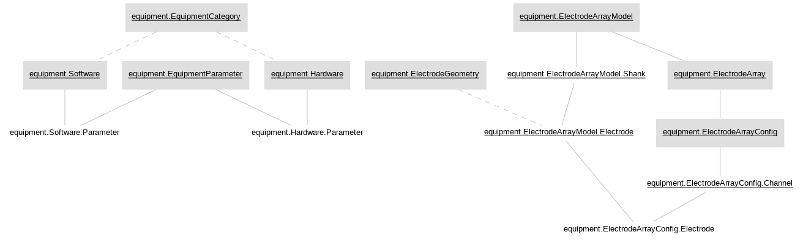

# Churchland Lab Pipeline

## Working with Python

### Installation and setup

1. Install [Docker](https://docs.docker.com/get-docker/). Then, if you are using Linux, install [Docker compose](https://docs.docker.com/compose/install/) (compose comes with Docker for Mac and Windows).

2. Fork the repository (https://github.com/ZuckermanBrain/datajoint-churchland) onto your own GitHub account by clicking on the 'Fork' button in the top right corner of Github.

3. Clone the forked repository to your local machine by running (after replacing YOUR-USERNAME with your GitHub username):
    ```console
    $ git clone https://github.com:YOUR-USERNAME/datajoint-churchland.git
    ```
    __Important:__ do *not* clone the repo from `ZukermanBrain`, but the one that you forked onto your own account!

4. Copy the file `.env_template` and rename it to `.env` in your favorite text editor in the cloned directory and **modify hostname, username and password values** inside `.env` file. This environment file specifies the credentials, and you will not need to enter these information while connecting to the DataJoint database inside the docker container

5. Now let's start to setup the docker environment. Inside the repository, run 
    ```console
    $ docker-compose up -d
    ```
    which sets up the docker environment with packages pre-installed. The files that customize the settings are `Dockerfile` and `docker-compose.yml`. After it is finished, you can check the status of the docker container by running 
    ```console
    $ docker ps
    ```

### Running

1. Create the docker container by running 
    ```console
    $ docker exec -it datajoint-churchland_datajoint_1 /bin/bash
    ```

2. You are able to run python or ipython here.

### Important notes about the directory

- `churchland_pipeline_python`: this is the main pipeline package. All the schema designs go into this directory. Inside the docker contained, it is mapped to `/src/datajoint-churchland/churchland_pipeline_python`. It is also preinstalled (editable) into the docker container, so inside the container, you can do `import churchland_pipeline` anywhere.

- All subdirectories in `datajoint-churchland` must be included as a listed volume in `docker-compose`. Add additional volumes as needed.

## Working with MATLAB

?

## Staying up-to date

To stay up-to-date with the latest code from DataJoint, you might first want to check by `git remote -v`.
If there is no upstream pointing to the ZuckermanBrain repository, then do `git remote add upstream https://github.com/ZuckermanBrain/datajoint-churchland`.

Then `git pull upstream master` will make sure that your local fork stays up to date with the original repo.

## Contributing code

If you feel happy with the changes you've made, you can add, commit and push them to your own branch. Then go to your fork on Github, click 'Pull requests', 'New pull request', 'compare across forks', and select your fork of `datajoint-churchland`. If there are no merge conflicts, you can click 'Create pull request', explain what changes/contributions you've made, and and submit it to the DataJoint team for approval.

## Pipeline schemas

### Equipment list


### Acquisition pipeline


### Common pipeline


### Neural pipeline


### EMG pipeline

