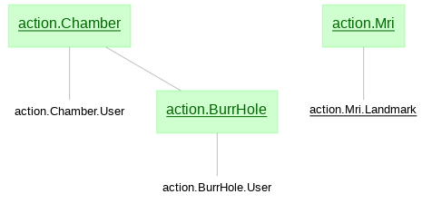
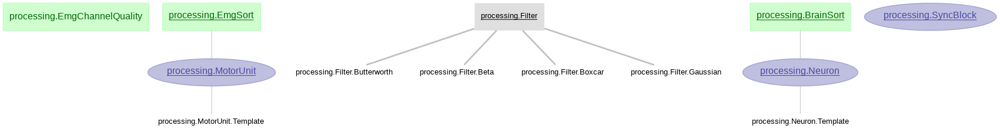
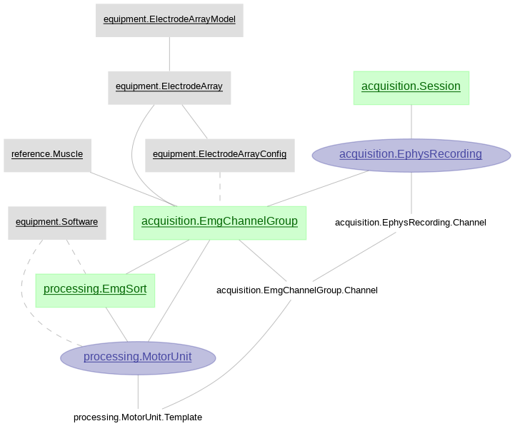

# Churchland Lab Pipeline

[U19 DataJoint documentation](https://confluence.columbia.edu/confluence/pages/viewpage.action?spaceKey=zmbbi&title=Datajoint)

## Getting started

### Users

If you simply want to access data stored in the database, but do not plan on making any changes, then follow the steps below, depending on your language of choice.

#### Python

1. **Create a virtual environment.**

    To create and activate an Anaconda environment (e.g., called "datajoint"), enter:

    ```console
    $ conda create -n datajoint python
    $ conda activate datajoint
    ```
    
2. **Install the pipline.**

    The [main repository](https://github.com/ZuckermanBrain/datajoint-churchland) (and its dependencies?) can be installed locally directly from git:

    ```console
    $ python -m pip install git+https://github.com/ZuckermanBrain/datajoint-churchland.git
    ```

3. **Connect to the remote (U19) database server.**

    Setup the connnection using DataJoint's `config` object. With the python interpreter or a jupyter notebook, enter:

    ```python
    import datajoint as dj
    dj.config['database.host'] = 'HOST_ADDRESS'
    dj.config['database.user'] = 'YOUR_UNI'
    dj.config['database.password'] = 'PASSWORD'
    ```

    after replacing YOUR_UNI with your Columbia uni. You will also need to acquire the database password from the lab admin. 
    
    To save your configuration in your local working directory, use `dj.config.save_local()`. Or, to save the configuration for all your projects, use `dj.config.save_global()`.

4. **Query a table.**

    You can import the entire pipeline or specific schemas with

    ```python
    from churchland_pipeline_python import *
    ```
    or
    ```python
    import churchland_pipeline_python.PACKAGE_NAME
    ```

    where PACKAGE_NAME is the name of the sub-directory under churchland_pipeline_python.

    To query a table, use
    
    ```python
    PACKAGE_NAME.TABLE_NAME()
    ```
    
    As a concrete example, replace PACKAGE_NAME with `lab` and TABLE_NAME with `Monkey` (i.e., `lab.Monkey()`).

#### MATLAB

1. **Install DataJoint.** 

    If using MATLAB > R2016b, this can be done from the built-in toolbar by navigating to _Home > Add-Ons > Get Add-Ons_. Search and select `DataJoint`, then select `Add from GitHub`. For other options, see the [DataJoint Installation Guide](https://github.com/datajoint/datajoint-matlab#installation).

2. **Clone the pipeline.** 

    Next, open the terminal and navigate to the directory where you want to store the pipeline files. Create a clone (local copy of the git repository) of the [main repository](https://github.com/ZuckermanBrain/datajoint-churchland) with the following command:

    ```console
    $ git clone https://github.com/ZuckermanBrain/datajoint-churchland.git
    ```

3. **Connect to the remote (U19) database server.** 

    From the MATLAB command window, enter the following commands:

    ```Matlab
    >> setenv('DJ_HOST', 'HOST_ADDRESS')
    >> setenv('DJ_USER', 'YOUR_UNI')
    >> setenv('DJ_PASS', 'PASSWORD')
    ```

    after replacing YOUR_UNI with your Columbia uni. You will also need to acquire the database password from the lab admin. 
    
    Verify the connection status by entering

    ```Matlab
    >> dj.conn()
    ```

    If you get a message that displays a connection_id and various connection properties (e.g, host name, user), then you're connected!

4. **Query a table.** 

    First, ensure that the cloned pipeline is on your MATLAB path. Then, enter in the command window:

    ```Matlab
    >> schema = PACKAGE_NAME.getSchema
    ```
    where PACKAGE_NAME is the name of the sub-directory under churchland_pipeline_matlab (prepended with a '+'). This will display all the tables in the schema. 
    
    To query a table, use

    ```Matlab
    >> schema.v.TABLE_NAME
    ```

    Again, you can find a list of all tables by re-entering `schema` in the command window. 
    
    You can replace `schema` with any variable name of your choosing. As a concrete example, try the following:

    ```Matlab
    >> lab = lab.getSchema
    >> lab.v.Monkey
    ```

### Contributers

If you want to access and develop on the database as well as easily stay up to date, then take the following steps. The first couple of steps are the same, regardless of your language of choice.

#### Python

1. **Fork the main repo.**

    Sign in to your GitHub account, navigate to https://github.com/ZuckermanBrain/datajoint-churchland, and click `fork` in the top-right corner of the page.

2. **Clone your fork.**

    On your local machine, navigate to the directory where you want to store the pipeline files. Create a clone of _your forked repo_ with the following command:

    ```console
    $ git clone https://github.com/YOUR_USERNAME/datajoint-churchland.git
    ```

    after replacing YOUR_USERNAME with your GitHub username.

3. **Create a virtual environment.**

    To create and activate an Anaconda environment (e.g., called "datajoint"), enter

    ```console
    $ conda create -n datajoint python
    $ conda activate datajoint
    ```

4. **Install an editable copy of the pipeline.**

    From within a jupyter notebook, execute

    ```python
    !{sys.executable} -m pip install PATH/TO/datajoint-churchland
    ```

5. **Setup environment variables.**

    Copy the file `.env_template` and rename it to `.env` in your favorite text editor in the cloned directory and **modify hostname, username and password values** inside `.env` file. This environment file specifies the credentials.

6. **Query a table.**

    You can import a schema with

    ```python
    from churchland_pipeline_python import PACKAGE_NAME
    ```

    where PACKAGE_NAME is the name of the sub-directory under churchland_pipeline_python. You can also replace PACKAGE_NAME with `*` to import all schemas.

    To query a table, use
    
    ```python
    PACKAGE_NAME.TABLE_NAME()
    ```
    
    As a concrete example, replace PACKAGE_NAME with `lab` and TABLE_NAME with `Monkey` (i.e., `lab.Monkey()`).

#### MATLAB

1. **Fork the main repo.**

    Sign in to your GitHub account, navigate to https://github.com/ZuckermanBrain/datajoint-churchland, and click `fork` in the top-right corner of the page.

2. **Clone your fork.**

    On your local machine, navigate to the directory where you want to store the pipeline files. Create a clone of _your forked repo_ with the following command:

    ```console
    $ git clone https://github.com/YOUR_USERNAME/datajoint-churchland.git
    ```

    after replacing YOUR_USERNAME with your GitHub username.

3. **Install DataJoint.** 

    If using MATLAB > R2016b, this can be done from the built-in toolbar by navigating to _Home > Add-Ons > Get Add-Ons_. Search and select `DataJoint`, then select `Add from GitHub`. For other options, see the [DataJoint Installation Guide](https://github.com/datajoint/datajoint-matlab#installation).

4. **Connect to the remote (U19) database server.** 

    From the MATLAB command window, enter the following commands:

    ```Matlab
    >> setenv('DJ_HOST', 'HOST_ADDRESS')
    >> setenv('DJ_USER', 'YOUR_UNI')
    >> setenv('DJ_PASS', 'PASSWORD')
    ```

    after replacing YOUR_UNI with your Columbia uni. You will also need to acquire the database password from the lab admin. 
    
    Verify the connection status by entering

    ```Matlab
    >> dj.conn()
    ```

    If you get a message that displays a connection_id and various connection properties (e.g, host name, user), then you're connected!

4. **Query a table.** 

    First, ensure that your cloned fork is on your MATLAB path. To query a table, use
    
    ```Matlab
    >> PACKAGE_NAME.TABLE_NAME()
    ```
    
    where PACKAGE_NAME is the name of the sub-directory under churchland_pipeline_matlab (prepended with a '+'). To find a list of tables for a given package, use 
    
    ```Matlab
    >> help PACKAGE_NAME
    ```

#### Staying up-to date

To stay up-to-date with the main repo, you will need to configure Zuckerman Brain as 'upstream' for your fork. Check this in the terminal by running

```console
$ git remote -v
```

If there is no upstream pointing to the Zuckerman Brain repository, then execute

```console
$ git remote add upstream https://github.com/ZuckermanBrain/datajoint-churchland`.
```

Then use `git pull upstream master` to pull the changes from the upstream repo into your local fork.

#### Contributing code

If you feel happy with the changes you've made, you can add, commit and push them to your own branch. Then go to your fork on Github, click 'Pull requests', 'New pull request', 'compare across forks', and select your fork of `datajoint-churchland`. If there are no merge conflicts, you can click 'Create pull request', explain what changes/contributions you've made, and and submit it to the DataJoint team for approval.

## Pipeline schemas

### Base schemas

#### Equipment


#### Lab


#### Reference


#### Action


#### Acquisition


#### Processing


### Joined schemas

#### Acquisition+


#### Neural


#### EMG
